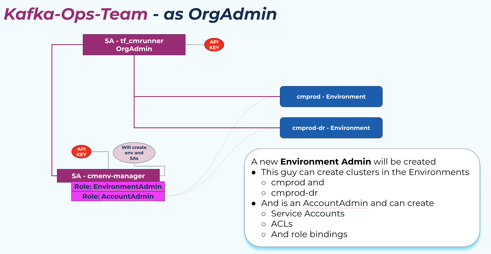
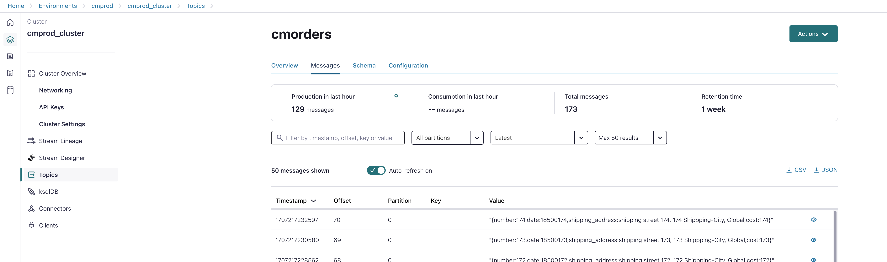
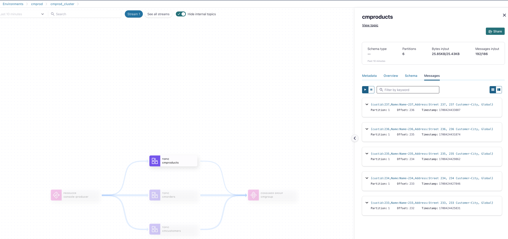

# Part1: Delegated Administration, Prod-Cluster Creation for cold-restore

We will first create a simple environment for the project team. They will get:
* 2 Confluent Cloud Environments
    1. cmprod for the production cluster
    2. cmprod-dr for the DR clusters
* Environment-Manager Service Account with Environment Admin role and Account Admin Role bind

## Create Cloud API Keys and Service Account 
Create a Confluent Cloud API Key as Org-Admin:
```bash
confluent login
confluent iam service-account create tf_runner_cmue --description "Terraform Service Account with OrgAdmin Role"
+-------------+--------------------------------+
| ID          | sa-XXXXXX                      |
| Name        | tf_runner_cmue                 |
| Description | Terraform Service Account with |
|             | OrgAdmin Role                  |
+-------------+--------------------------------+
# Align a Role
confluent iam rbac role-binding create --principal User:sa-XXXXXX  --role OrganizationAdmin
+-----------+-------------------+
| ID        | rb-XYBZTe         |
| Principal | User:sa-XXXXXX    |
| Role      | OrganizationAdmin |
+-----------+-------------------+
# Create API Key
confluent api-key create --resource cloud --service-account sa-XXXXXX --description "API Key for tf_runner_cmue OrgAdmin"
It may take a couple of minutes for the API key to be ready.
Save the API key and secret. The secret is not retrievable later.
+------------+------------------------------------------------------------------+
| API Key    | KEYXXXXXXXXXXXXX                                                 |
| API Secret | SECRETYYYYYXXXXXXYXYXXXXXXXXXXXXXXXXXXXXXXXXXXXXXXXXXXXXXXXXXXXX |
+------------+------------------------------------------------------------------+
```

Your terraform OrgAdmin Service Account is ready to use. Store the API key in Environment Variables:

```bash
cd Part1/01-kafka-ops-team
# SA tf_cmrunner_cmue
export TF_VAR_confluent_cloud_api_key="KEYXXXXXXXXXXXXX"
export TF_VAR_confluent_cloud_api_secret="SECRETYYYYYXXXXXXYXYXXXXXXXXXXXXXXXXXXXXXXXXXXXXXXXXXXXXXXXXXXXX"
``` 

Or store Key and secret into a file `terraform.tfvars` (will be read by terraform automatically)

```bash
cd Part1/01-kafka-ops-team
cat > terraform.tfvars <<EOF
confluent_cloud_api_key = "KEYXXXXXXXXXXXXX"
confluent_cloud_api_secret = "SECRETYYYYYXXXXXXYXYXXXXXXXXXXXXXXXXXXXXXXXXXXXXXXXXXXXXXXXXXXXX"
EOF
``` 

terraform is now able to communicate with the Confluent Cloud API and will create a couple of resources.

* Create 2 environments
* Create new Service Account with API Keys



Start terraform now:

```bash
# we are in this folder Part1/01-kafka-ops-team
# First act as Ops team, create Environment and env-manager
terraform init
terraform plan
terraform apply --auto-approve
# Output
# Apply complete! Resources: 8 added, 0 changed, 0 destroyed.
# Outputs:
# envid = "env-XXXX"
# envid-dr = "env-YYYYY"
# key = "YYYYYYYYYYYYYY"
# resource-ids = <sensitive>
# secret = <sensitive>
```

The `terraform apply` will generate a file:`env-source` , which will be copied into the product team folder `Part1/02-env-admin-product-team` and `Part3/02-env-admin-product-team`. This file will be used by product team, which includes all they need to work with Confluent Cloud. (you need to source it soon). They will operate as Delegated Admin for the both created environments.

## Build the cloud resource as a product team environment admin 

Now, you can act a Admin Product Team with the Service Account `cmenv-manager`. This was pretty fresh created (see section above).
Create the Prod-Cluster now:

```bash
cd ../02-env-admin-product-team
# source envid and API key of env-manager file was generated by terraform
source env-source
# Create cloud resources
terraform init
terraform plan
terraform apply --auto-approve
# Apply complete! Resources: 20 added, 0 changed, 0 destroyed.
# Outputs:
# appmanid = "sa-!"
# appmanidapiversion = "iam/v2"
# appmanidkind = "ServiceAccount"
# cc_kafka_cluster_bootsrap = "SASL_SSL://XXXXX1.region.csp.confluent.cloud:9092"
# consumer_group = "cmgroup"
# consumer_key = "WYNNNNNNN"
# consumer_secret = <sensitive>
# consumerid = "sa-2"
# consumeridapiversion = "iam/v2"
# consumeridkind = "ServiceAccount"
# producer_key = "HAYYYYYYYYYY"
# producer_secret = <sensitive>
# producerid = "sa-3"
# produceridapiversion = "iam/v2"
# produceridkind = "ServiceAccount"
# resource-ids = <sensitive>
``` 

By default we will use k3s for the client setup. So all clients and secrets will be provision automatically in the default k8s cluster (see `.k9s/config.xml`). If you want to run shell scripts then an `iterm2` with shell clients will be opened (optional, you need to comment the section in `00_create_client.properties.sh` , see below). If you would like to run shell scripts:

* you need to change the "Client 2" section at the end of `00_create_client.properties.sh` and comment the "Client 1" section and then uncomment the "Client 2" section.
* If you run k8s, you need to change nothing

A new source file `env-source` is copied to folder `../../Part2/cold-restore/` and `../../Part3/02-env-admin-product-team/`. We need these environment variables later in our labs.

You have now deployed a confluent cloud cluster `cmpro_cluster_basic` in environment `cmprod` and a couple of consumers and producers running in k3s cluster .
Check the events flowing as followed:

In Cloud UI: go to cluster in cmprod environment -> Topic and check messages in cmorders



Or just have a look on Stream lineage and see how the events are flowing.



How many clients are running, use kubectl tools:
```bash
# Are the pods running (producer and consumer)?
kubectl get pods -n confluent
# NAME                                  READY   STATUS    RESTARTS      AGE
# confluent-operator-6b9f68dc5c-rl62w   1/1     Running   7 (16h ago)   64d
# cloudproducercmorders-0               1/1     Running   0             11m
# cloudconsumercmproducts-0             1/1     Running   0             11m
# cloudproducercmcustomers-0            1/1     Running   0             11m
# cloudconsumercmcustomers-0            1/1     Running   0             11m
# cloudproducercmproducts-0             1/1     Running   0             11m
# cloudconsumercmorders-0               1/1     Running   0             4s

# Show logged data of consumer
kubectl logs cloudconsumercmorders-0 -n confluent
kubectl logs cloudconsumercmcustomers-0 -n confluent
# ...
# {number:417,date:18500417,shipping_address:shipping street 417, 417 Shippping-City, Global,cost:417}
# {number:418,date:18500418,shipping_address:shipping street 418, 418 Shippping-City, Global,cost:418}
# {number:419,date:18500419,shipping_address:shipping street 419, 419 Shippping-City, Global,cost:419}
# ...
``` 

List topics on Prod-Cluster:

```bash
./00_list_all_topics.sh
```

Consumers and producers running in k8s cluster and doing their job.
By the way I only use kafka tools. This makes it much more easier for non-developers. The Producer is just a "FOR Loop" and Producing stupid data.

# Monitor offset of Consumper Group

Run:

```bash
./00_run_offset_monitor.sh
```

## Simulate Cluster Break

I will not destroy the cluster, just the moving the clients later. But if you want to destroy:
* To simulate a cluster break, delete the cluster.
* Imagine we would destroy the prod-cluster. Just do terraform destroy in folder `Part1/02-env-admin-product-team`

```bash
# Destroy the prod cluster
terraform destroy --target confluent_kafka_cluster.basic
``` 

Cluster will be then destroyed by terraform, including all resources, like cluster roles, topics, cluster keys etc.
Results:
* Consumer breaks immediately: group authorization failed, pod will be terminated `kubectl get pods -n confluent`
* producer still in loop trying to produce: Error: Connection to Node?

After break (or non break) we build a new cluster (cold restore) and refresh the client configs, and the clients will start automatically on the new cluster.

back to [continue with Part2 Cold-Restore](part2.md)