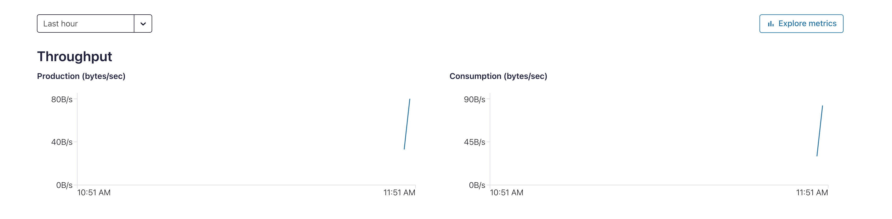
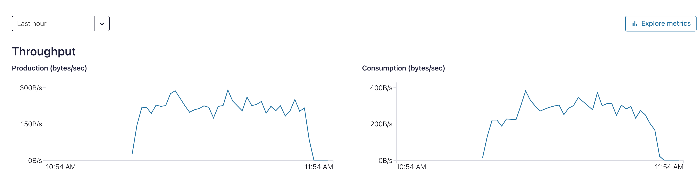

# Part 2: Do cold restore for broker prod cluster

Build a new  Cluster with same resources and switch clients to new cluster. For this DR case customers typically has not the requirement of any data replication because their leading systems are outside of Kafka cluster and will be integrated via clients like connectors. Our clients simulate this.

Source the environment variables, including all Service Accounts.
```bash
cd ../../Part2/cold-restore/
# We will now use the cmprod-dr environment 
# Source env-cars
source env-source
```

Build new (basic) cluster in cmprod-dr environment and generate new Keys for the client Service Accounts:

```bash
terraform init
terraform plan
terraform apply --auto-approve
# Apply complete! Resources: 11 added, 0 changed, 0 destroyed.
# Outputs:
# appmanid = "sa-1"
# cc_kafka_cluster_bootsrap = "SASL_SSL://pkc-75m1o.europe-west3.gcp.confluent.cloud:9092"
# consumer_group = "cmgroup"
# consumer_key = "X5XXXXXXX"
# consumer_secret = <sensitive>
# consumerid = "sa-2"
# manager_key = "45XXXXX"
# manager_secret = <sensitive>
# producer_key = "JJXXXXXX"
# producer_secret = <sensitive>
# producerid = "sa-3"
# resource-ids = <sensitive>
``` 

The `terraform apply` will generate new client properties files and load them into k8s secrets. So to say do a rewrite. The reloader then starts the clients automatically with the new config. All clients will be moved automatically to new DR cluster and running now with DR Cluster.
Clients are writing now into dr cluster and reading from it.
Check: 

* in Cloud UI: go to cluster in cmprod-dr environment -> Topic and check messages in cmorders
* use kubectl tools:

```bash
# Are the pods running (producer and consumer)? The will restart automatically
kubectl get pods -n confluent
# NAME                                  READY   STATUS             RESTARTS      AGE
# confluent-operator-6b9f68dc5c-rl62w   1/1     Running            7 (19h ago)   64d
# cloudconsumercmorders-0               1/1     Running            0             2m40s
# cloudproducercmproducts-0             1/1     Running            0             2m10s
# cloudproducercmorders-0               1/1     Running            0             2m10s
# cloudproducercmcustomers-0            1/1     Running            0             2m10s
# cloudconsumercmproducts-0             0/1     CrashLoopBackOff   4 (18s ago)   2m39s
# cloudconsumercmcustomers-0            0/1     CrashLoopBackOff   4 (16s ago)   2m40s
# Show heich data the consumer can now read
kubectl logs cloudconsumercmorders-0 -n confluent
``` 

Consumers and producers are running now in cmprod-dr cluster and throughput is increasing



On prod cluster the throughput went to 0.




Check Topics:
```bash
./00_list_all_topics.sh
```

Check Offset Monitoring:
```bash
./00_run_offset_monitor.sh
```
As you see there is no consumer offset sync, consumer start from latest on DR cluster.

## Switchback clients

Switch Back client to Prod
```bash
cd ../../Part1/02-env-admin-product-team/
# Run shell script to load the client properties from prodcluster into k8s secrets.
./01_switchback_client.properties.sh 
# Kubectl : all pods should run
kubectl get pods -n confluent
```

Clients are back on cmprod_cluster.

# Development-HINT:
<table><tr><td>My simple demo is just for show-case a DR scenario with a really simple case. From a coding perspective it would be better if you structure your IaaS in modules.</td></tr></table>

# Destroy Cold Restore Cluster: Part 1 and Part2

# Destroy
Destroy the complete demo:

## Destroy k3s
First the pods and secrets:

```bash
cd Part1 # or Part4/active-active
# Pods
kubectl get pods -n confluent
kubectl delete  -f cloudconsumercmorders.yaml --namespace confluent
kubectl delete  -f cloudproducercmorders.yaml --namespace confluent
kubectl delete  -f cloudconsumercmproducts.yaml --namespace confluent
kubectl delete  -f cloudproducercmproducts.yaml --namespace confluent
kubectl delete  -f cloudproducercmcustomers.yaml --namespace confluent
kubectl delete  -f cloudconsumercmcustomers.yaml  --namespace confluent
# all pods should be terminated or in termination
kubectl get pods -n confluent

# Secrets
kubectl get secrets -n confluent
kubectl delete secret kafka-client-consumer-config-secure -n confluent
kubectl delete secret kafka-client-producer-config-secure -n confluent
kubectl get secrets -n confluent
``` 

## Shutdown k3 cluster
```bash
ssh -i ~/keys/k3s-key ubuntu@cpworker1
sudo shutdown -h now
ssh -i ~/keys/k3s-key ubuntu@cpworker2
sudo shutdown -h now
ssh -i ~/keys/k3s-key ubuntu@cpworker3
sudo shutdown -h now
ssh -i ~/keys/k3s-key ubuntu@cpmaster
sudo shutdown -h now
```

## Destroy DR cluster from cold-restore

```bash
cd ../Part2/cold-restore
source env-source
terraform destroy
```

## Destroy Prod Cluster

```bash
cd ../../Part1/02-env-admin-product-team
source env-source
terraform destroy
```

## Destroy Env and Env-Manager

```bash
cd ../01-kafka-ops-team
terraform destroy
```

## Client properties files

```bash
cd ../..
rm Part1/*.properties
rm Part1/02-env-admin-product-team/env-source
rm Part2/cold-restore/env-source
rm Part2/cold-restore/env-source-e
```

Back to [continue with Part 3](part3.md) or [go back to main Readme](ReadMe.md)