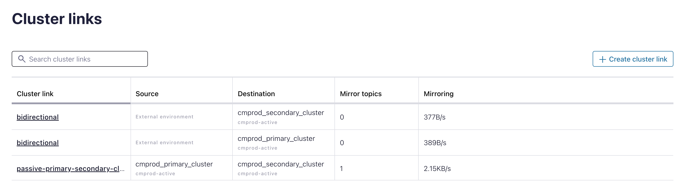

# Cluster Setup with an DR Apps design

The Part3 covers

* active-passive Cluster DR design
* active-active Cluster DR design
* Planned DR exercise with bidirectional Cluster Link

All are working with Cluster Linking (Replicator is not covered in this repo).

## Create Dedicated Cluster setup with Cluster Links

We use the same OrgAdmin API Key mentioned in [Part1: Create Cloud API Keys and Service Account](part1.pmd).
Store the API key in Environment Variables:

```bash
cd Part3/01-kafka-ops-team
# SA tf_cmrunner
export TF_VAR_confluent_cloud_api_key="KEYXXXXXXXXXXXXX"
export TF_VAR_confluent_cloud_api_secret="SECRETYYYYYXXXXXXYXYXXXXXXXXXXXXXXXXXXXXXXXXXXXXXXXXXXXXXXXXXXXX"
``` 

Or store Key and secret into a file `terraform.tfvars` (will be read by terraform automatically)

```bash
cd Part3/01-kafka-ops-team
cat > terraform.tfvars <<EOF
confluent_cloud_api_key = "KEYXXXXXXXXXXXXX"
confluent_cloud_api_secret = "SECRETYYYYYXXXXXXYXYXXXXXXXXXXXXXXXXXXXXXXXXXXXXXXXXXXXXXXXXXXXX"
EOF
``` 

terraform is now able to communicate with the Confluent Cloud API and will create a couple of resources.

* Create 1 environments `cmprod-active`, this time I have both clusters in one environment. Typically you will use 2 environments, because the Schema Registry would also effected in a DR case, and Schemas can be synched into a new region with Schema Linking.
* Create new Env Manager Service Account with API Keys


Start terraform now:

```bash
# we are in this folder Part3/01-kafka-ops-team
# First act as Ops team, create Environment and env-drmanager
terraform init
terraform plan
terraform apply --auto-approve
# Output
# Apply complete! Resources: 6 added, 0 changed, 0 destroyed.
# Outputs:
# envid = "env-XXXX"
# key = "YYYYYYYYYYYYYY"
# resource-ids = <sensitive>
# secret = <sensitive>
terraform output resource-ids
```

The `terraform apply` will generate a file:`env-source` , which will be copied into the product team folder `Part3/02-env-admin-product-team`. This file will be used by product team, which includes all they need to work with Confluent Cloud. (you need to source it soon). They will operate as Delegated Admin for the created environment.

## Build the cloud resource as a product team environment admin 

Now, you can act a Admin Product Team with the Service Account `cmenv-drmanager`. This was pretty fresh created (see section above).
Create the Prod-Cluster setup including the DR cluster and 2 cluster links now:

In this lab we will create a active and passive DR Clusters with Cluster Linking. This cluster is from type dedicated and costs more money than basic. Please check [price list](https://www.confluent.io/confluent-cloud/pricing/) before continue.

```bash
cd ../02-env-admin-product-team
# source envid and API key of env-manager file was generated by terraform
source env-source
# Create cloud resources
terraform init
terraform plan
terraform apply --auto-approve
terraform output resource-ids
```

Two dedicated cluster in two different regions and two different cloud providers are created. This is Gold-Standard for DR.


These clusters are linked with three cluster links or better 2 cluster links. The bidirectional link in created as one link in each cluster under the same name.


Now, you can start the clients:

```bash
# Before starting the clients, have your k8s cluster up and running
./00_start_clients.sh
```

pod_status=$(kubectl get pods -n confluent -o jsonpath="{.items[?(@.metadata.name.includes('$pod_name'))].status.phase}")

In total I started 6 clients on prod cluster

* 3 Consumer


* 3 Producer


* And we have clients for the cluster links running (test topic is mirrored).

## Active-Passive Cluster setup

Two Clusters from type dedicated are running in our environment `cmprod-active`.

Both dedicated clusters are with Public network endpoints, a test topic in source cluster , a one-directional-cluster-link between both clusters and a mirror topic on the test topic.
The cluster link will get the following config set:

* consumer.offset.sync.enable=true
* consumer.offset.group.filters={"groupFilters": [{"name": "*","patternType": "LITERAL","filterType": "INCLUDE"}]}
* consumer.offset.sync.ms=1000
* acl.sync.enable=true
* acl.sync.ms=1000
* acl.filters={ "aclFilters": [ { "resourceFilter": { "resourceType": "any", "patternType": "any" }, "accessFilter": { "operation": "any", "permissionType": "any" } } ] }
* topic.config.sync.ms=1000

The idea now is not to copy the complete content from **primary_cluster** to **secondary_cluster**. We run special SLA for special resources.
Only Gold SLA Topics should be in our DR setup. These are topics with a high requirement regarding uptime and HA in general.
There are couple of resources (topics) marked as GOLD and documented in `cat Part3/active-passive/scripts/sla_gold_topics.txt`. Only these resources will be mirrored in secondary_cluster.

### Running the SLA based DR Plan

In our case we do have only one topic which needs to be geo-replicated because of high HA requirements.

```bash
cd ../active-passive/
source env-destination 
./scripts/00_create_mirror_topics.sh
# Press Enter if you asked for and follow the description in script
```

After fail-over and client switch, only two clients are running on secondary cluster:

* the producer for topic cmorders (stopped mirror topic)
* and the consumer for topic cmorders


The mirror topic is stopped.


Now, you can play a little bit in the Cloud UI. This is quite interesting. But be aware the status update in UI takes a moment.
Check:

* Cluster Linking Menu (left side)
* Show Topics in DR Cluster, is data coming from `cmprod_primary_cluster`?
* Is client running now on secondary cluster?
* etc.

Check producer and data consumer is now running on mirrored topic in secondary_cluster:

```bash
# Check client is now running on secondary cluster
kubectl logs prod-cloudconsumercmorders-0 -n confluent
# List topics in secondary cluster
./00_list_all_topics.sh
# check if offset on secondary cluster looks good
./00_run_offset_monitor.sh
# run confluent cli, to Last Source Fetch Offset
# How do I know the data was successfully copied to the destination and can be safely deleted from the source topic? 
# Check “Last Source Fetch Offset.” Anything before that offset in that partition has been replicated.
confluent kafka mirror describe cmorders --cluster $cluster_destination_id --environment $destination_envid --link passive-primary-secondary-cluster
# run link task for active-passive Clink (confluent version 3.53 is needed for a task list)
./00_run_link_task.sh
```

### Fail Forward or Fail-and-stay

Now, we have situation after failover. In a cloud native environment we would recommend to fail forward. This means

* the DR region becomes the new Primary region.
* cloud regions offer identical service
* all applications & data systems are now in the DR region
* failing back would introduce risk with little benefit

To fail forward, simply:

* Delete topics on original cluster (or spin up new cluster)
* Establish cluster link in reverse direction (or bidirectional cluster link was created, not here. see active-active)

### Fail back

Another Alternative would be to fail back to prod-cluster from DR-cluster.

1. Delete topics on Primary cluster (or spin up a new cluster)
2. Establish a cluster link in the reverse direction
3. When Primary has caught up, migrate producers & consumers back:
    a. Stop clients
    b. promote mirror topic(s)
    c. Restart clients pointed at Primary cluster

### Recovery After a Disaster

Cluster linking is asynchronous, that's why it could be that not all make it over to the DR cluster.
If the prod cluster will come back (temp outage) and there could be some data which were never replicated

1. Find the offsets at which the mirror topics were failed over.

```bash
source env-destination
confluent kafka mirror describe cmorders --cluster $cluster_destination_id --environment $destination_envid --link passive-primary-secondary-cluster
# Last Source Fetch Offset was time we start stop mirroring (or do failover)
#  Link Name      |Mirror Topic| Source Topic | Mirror Status | Status Time (ms) | Partition | Partition Mirror Lag | Last Source Fetch Offset  
#-----------------+------------+--------------+---------------+------------------+-----------+----------------------+--------------------------
#  passive-primary| cmorders   | cmorders     | STOPPED       |    1708443298951 |         0 |                    0 |                     1368  
#  -secondary-
#  cluster 
```

2. With those offsets in hand, point consumers at your original cluster, and reset their offsets to those you found in. Your consumers can then recover the data and act on it as appropriate for their application. Or use replicator to add data into DR cluster topics

## Active-Active Cluster setup

First switch back clients to Primary Cloud:

* The producer for cmorders
* The consumer for cmorders

```bash
./01_switchback_client.properties.sh 
kubectl get pods -n confluent
kubectl logs prod-cloudconsumercmorders-0 -n confluent
# Check Offsets
./00_run_offset_monitor.sh
```

The offset is now again very different. On Primary we start where we leave, on Secondary we do have higher offset, because we failed-over and switched clients.

**Let's do the active-active setup**:

For the active-active Part we use bi-directional Cluster Link `bidirectional` on both clusters.

The cluster link will get the following config set:
* consumer.offset.sync.enable=true
* consumer.offset.group.filters={"groupFilters": [{"name": "*","patternType": "LITERAL","filterType": "INCLUDE"}]}
* consumer.offset.sync.ms=1000
* acl.sync.enable=false (not allowed with prefix)
* acl.sync.ms=1000
* acl.filters={ "aclFilters": [ { "resourceFilter": { "resourceType": "any", "patternType": "any" }, "accessFilter": { "operation": "any", "permissionType": "any" } } ] }
* topic.config.sync.ms=1000
* cluster.link.prefix=mirror-

```bash
cd ../active-active
source env-destination
# Check status bidirectional link
confluent kafka link describe bidirectional --cluster $cluster_source_id --environment $source_envid
#+---------------------+---------------+
#| Name                | bidirectional |
#| Source Cluster      |               |
#| Destination Cluster |               |
#| Remote Cluster      | lkc-x6XXXk    |
#| State               | ACTIVE        |
#+---------------------+---------------+
confluent kafka link describe bidirectional --cluster $cluster_destination_id --environment $destination_envid
#+---------------------+---------------+
#| Name                | bidirectional |
#| Source Cluster      |               |
#| Destination Cluster |               |
#| Remote Cluster      | lkc-v8XXX5    |
#| State               | ACTIVE        |
#+---------------------+---------------+
```
Both parts should be active.


The idea is to follow that [tutorial](https://docs.confluent.io/cloud/current/multi-cloud/cluster-linking/dr-failover.html#active-active-tutorial) in a script.

* Create writable topics
    a. prod: cmcustomers on dr: mirror-cmcustomers
* Create a bidirectional cluster link (this is done)

We follow here again the idea of a SLA DR Plan: do not copy the complete content from primary cluster to secondary cluster and vice versa. We have special SLA for special resources. We call it the "**Gold topic SLA**".
There are couple resources marked as GOLD  and documented in `cat scripts/sla_gold_topics.txt`. Only these resources will be mirrored in both clusters.

Running the SLA based DR Plan: 
In our case we do have only one topic which needs to be geo-replicated because of high HA requirements. Please do not forget, this is a DR application design task.

```bash
./scripts/00_create_mirror_topics.sh
# Press enter if you asked for
kubectl get pods -n confluent
kubectl logs dr-cloudconsumercmcustomers-primary-0 -n confluent
kubectl logs dr-cloudconsumercmcustomers-secondary-0 -n confluent
kubectl logs dr-cloudproducercmcustomers-primary-0 -n confluent
kubectl logs dr-cloudproducercmcustomers-secondary-0 -n confluent
# Check Link task status of both active-active Links (confluent version 3.53 is needed for a task list)
./00_run_link_task.sh
# Your will see an error because I used different names for the cluster link in both clusters. To better show the case.
# Show Link Task of cluster link bidirectional in primary cluster: 
#      Task Name      |     State      | Errors  
#---------------------+----------------+---------
#  AclSync            | NOT_CONFIGURED |         
#  AutoCreateMirror   | NOT_CONFIGURED |         
#  ConsumerOffsetSync | ACTIVE         |         
#  TopicConfigsSync   | ACTIVE         |         
#
# Show Link Task of cluster link bidirectional secondary cluster: 
#      Task Name      |     State      | Errors  
#---------------------+----------------+---------
#  AclSync            | NOT_CONFIGURED |         
#  AutoCreateMirror   | NOT_CONFIGURED |         
#  ConsumerOffsetSync | ACTIVE         |         
#  TopicConfigsSync   | ACTIVE         |               
```

We do have now following clients structure:

* Primary: 
  * prod-cloudconsumercmorders and 
  * prod-cloudproducercmorders
  * dr-cloudconsumercmcustomers-primary and
  * dr-cloudproducercmcustomers-primary
* Secondary
  * dr-cloudproducercmcustomers-secondary and
  * dr-cloudconsumercmcustomers-secondary

The next script show the cycle of mirror between clusters. Here you need iTerm installed and a MAC. I am using OASCRIPT here:

```bash
# Check Mirror Cycle
./01_check_mirror_cycle.sh
# Or manually
# Primary topics consumer group simulation
# Topic on primary
kafka-console-consumer --bootstrap-server  $(awk '/bootstrap.servers=/{print $NF}' ../kafkatools_consumer_primary.properties | cut -d'=' -f 2) --topic cmcustomers --consumer.config ../kafkatools_consumer_primary.properties
# Mirror topic on primary
kafka-console-consumer --bootstrap-server  $(awk '/bootstrap.servers=/{print $NF}' ../kafkatools_consumer_primary.properties | cut -d'=' -f 2) --topic mirror-cmcustomers --consumer.config ../kafkatools_consumer_primary.properties
# Secondary topics consumer group simulation
# topic on secondary
kafka-console-consumer --bootstrap-server  $(awk '/bootstrap.servers=/{print $NF}' ../kafkatools_consumer_secondary.properties | cut -d'=' -f 2) --topic cmcustomers --consumer.config ../kafkatools_consumer_secondary.properties
# mirror topic on secondary
kafka-console-consumer --bootstrap-server  $(awk '/bootstrap.servers=/{print $NF}' ../kafkatools_consumer_secondary.properties | cut -d'=' -f 2) --topic mirror-cmcustomers --consumer.config ../kafkatools_consumer_secondary.properties
```

We did setup an active-active disaster recovery setup for `cmcustomers` topic.


Now, you can play a little bit in the Cloud UI. This is quite interesting. Check:

* Cluster Linking Menu (left side)
* Show Topics in secondary Cluster, is data coming from primary cluster?
* etc.

Play-Around with active-active setup now. See [docu](https://docs.confluent.io/cloud/current/multi-cloud/cluster-linking/dr-failover.html#active-active-tutorial).

Delete all k8s clients running in K8s:

```bash
# delete all clients to have a better view with our next lesson
cd ..
./03_destroy_k8s_clients.sh
```

## Planned DR Exercise with bi-directional cluster link setup

Till 20 March the new `reverse-and-start` feature is GA. This will be best for planned DR, like exercises. Please see [documentation](https://docs.confluent.io/cloud/current/multi-cloud/cluster-linking/mirror-topics-cc.html#reverse-a-source-and-mirror-topic).

We do a planned DR exercise in 6 simple steps. Here you find the requirements for reverse testing:

* The cluster link must be in Bidirectional mode.
* Both clusters must be Confluent Cloud Dedicated clusters.
* Both clusters must be healthy and able to communicate over the network.
* You must have the CLUSTER:ALTER ACL or the Admin role on the cluster where this command is run.


To run a planned DR, I prepared a simple script. Start it and follow the step-by-(press enter) step and see what is happening. We will start with one topic `cmtopic` on primary cluster. This topic will be mirrored, clients will be switched and mirror topic will become main topics etc.... and then we switch back. Let's start and run:

```bash
# Start script
cd active-active
./scripts/01_run_planned_dr.sh
# please follow instructions in script
```

After a successful execution you switched from primary to secondary and back to primary without loosing data. 
Your DR exercise is finished. Now, you can sleep pretty well, because you know, that in a DR case and will know what you should do.

Delete the resource around Planned DR Exercise
```bash
./scripts/02_delete_planned_dr.sh
```

## Destroy dedicated cluster setup

### Clients

```bash
# cd Part3/
cd ..
#./03_destroy_k8s_clients.sh
./04_destroy_k8s_clients.sh
```

### Shutdown k8s cluster

```bash
ssh -i ~/keys/k3s-key ubuntu@cpworker1
sudo shutdown -h now
ssh -i ~/keys/k3s-key ubuntu@cpworker2
sudo shutdown -h now
ssh -i ~/keys/k3s-key ubuntu@cpworker3
sudo shutdown -h now
ssh -i ~/keys/k3s-key ubuntu@cpmaster
sudo shutdown -h now
```

### Confluent cloud cluster

delete the mirror topics first in Cloud UI: Look at each link.
We really need **0 mirror topics**.


```bash
cd 02-env-admin-product-team/
source env-source
# delete the mirror topics first in Cloud UI: Look at each link
terraform destroy
# Environments
cd ../01-kafka-ops-team/
terraform destroy
# Properties Files
cd ..
rm *.properties
```

When you got no errors all Confluent Cloud resources should be deleted now.

back to [main Readme](ReadME.md)